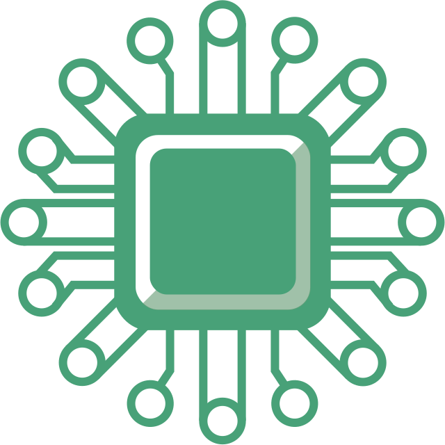
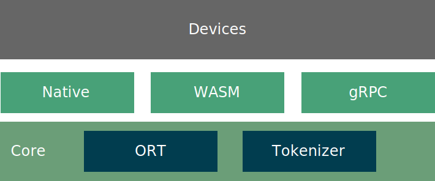

  

<h1 align="center">Edge Infer</h1>

  

> EdgeInfer enables efficient edge intelligence by running small AI models, including embeddings and OnnxModels, on
> resource-constrained devices like Android, iOS, or MCUs for real-time decision-making.

Architecture:

Platform support (by Design):

- Android, iOS
- Linux, Windows, Mac,
- Raspberry Pi, MCU

## Todos

- [x] Inference wrapper
    - [x] Onnx Runtime
    - [x] Tokenizer
- [x] [UniFFI](https://github.com/mozilla/uniffi-rs), is a toolkit for building cross-platform software components in
  Rust.
- [ ] GRPC server with [tonic](https://github.com/hyperium/tonic)
- [ ] Multiple OS support:
    - Desktop: Windows, Mac, Linux (x86, x64)
    - Mobile: Android, iOS, Linux (ARM)
    - Embedded Linux (ARM).
- [ ] Flexible Configuration: Easily configurable via command-line parameters, including listening port, batch size,
  thread count, and others.

## Usecases

- [ ] SearchEverywhere: Search for anything, anywhere, anytime.
    - Model: Embedding,
      like [Sentence-Transformers MiniLM](https://huggingface.co/sentence-transformers/all-MiniLM-L6-v2)
    - Extra: Local Indexing
- [ ] Visualization
    - Model: [Ultralytics YOLOv9](https://github.com/ultralytics/ultralytics)
- [ ] AutoComplete
    - Model: Embedding with ??
- [ ] Summarization

## Resources

### MCU

ToSpike

- ESP32: [esp-rs](https://github.com/esp-rs)
- Raspberry Pi Classic
    - [built-onnxruntime-for-raspberrypi-linux](https://github.com/nknytk/built-onnxruntime-for-raspberrypi-linux)
    - [ONNX Runtime IoT Deployment on Raspberry Pi](https://onnxruntime.ai/docs/tutorials/iot-edge/rasp-pi-cv.html)

Not working:

- Arduino M0 Pro, Flash: 256 KB, SRAM: 32Kb
    - Official: [Arduino M0 Pro](https://docs.arduino.cc/retired/boards/arduino-m0-pro)
    - Rust's [cortex-m-quickstart](https://github.com/rust-embedded/cortex-m-quickstart)
- Raspberry Pi Zero W, Flash: 512 MB, SRAM: 512 MB
    - Official: [Raspberry Pi Zero W](https://www.raspberrypi.com/products/raspberry-pi-zero/)
    - [Using Rust to Control a Raspberry Pi Zero W Rover](https://disconnected.systems/blog/rust-powered-rover/)
    - Not working reason: See in [inference_rpi](inference_rpi/README.md)

## License

This project is licensed under the MIT License, See [LICENSE](LICENSE) for the full license text.
